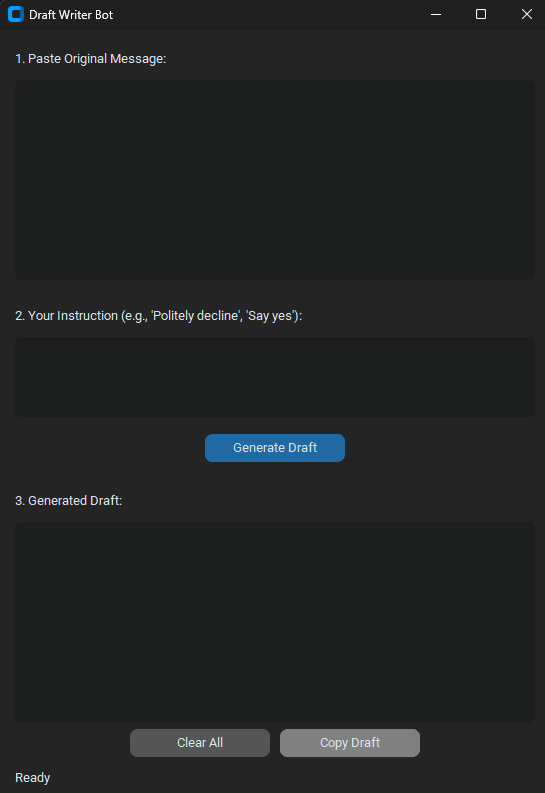

# Draft Writer Bot

A simple, privacy-focused Windows desktop application that uses a locally running small language model (via Ollama) to help you quickly draft replies to messages, with streaming output.



## Features

* **Simple Interface:** Easily paste the original message and your instruction.
* **AI-Powered Drafts:** Generates draft replies based on your intent using a local LLM.
* **Streaming Output:** See the AI response appear word-by-word for a responsive feel.
* **Local & Private:** Uses Ollama to run a language model directly on your machine. Your messages and instructions are **never** sent to any external cloud service, ensuring your privacy.
* **Offline Capable:** Works without an internet connection after the initial setup of Ollama and the model.
* **Lightweight:** Designed to work with very small LLMs (like the default `qwen2.5:0.5b`) suitable for less powerful computers.
* **Copy to Clipboard:** Easily copy the fully generated draft with a single click.
* **Clear Inputs:** Button to quickly clear all text fields and reset for a new task.
* **Status Bar:** Provides feedback on the current application state (Ready, Generating, Copied, Error).
* **Dark Theme:** Uses a modern dark theme provided by CustomTkinter.

## Prerequisites

Before you install and run Draft Writer Bot, you **must** have the following installed and configured:

1.  **Python:** Version 3.9 or higher is recommended (the application was developed with 3.13). Ensure Python is added to your system's PATH during installation. You can download Python from [python.org](https://www.python.org/).
2.  **Ollama:** This application relies entirely on Ollama to run the language model locally.
    * Download and install Ollama for Windows from the official website: [ollama.com](https://ollama.com/).
    * Follow their installation instructions.
3.  **Ollama Language Model:** After installing Ollama, you need to download the specific language model the application will use. The default and recommended lightweight model is `qwen2.5:0.5b`.
    * Open your Command Prompt or PowerShell.
    * Run the command:
        ```bash
        ollama pull qwen2.5:0.5b
        ```
    * Wait for the download (approx. 400MB) to complete.
    * **(Important):** Ensure the **Ollama application/service is running in the background** *before* you start Draft Writer Bot. You can usually check this from your system tray or by running `ollama list` in the terminal.

## Installation

You can install Draft Writer Bot using one of the following methods:

**Option 1: From PyPI (Recommended Method)**

1.  Open Command Prompt or PowerShell.
2.  Run the following command:
    ```bash
    pip install draft-writer-bot
    ```
3.  This will download and install the application and its dependencies (`customtkinter`, `httpx`).

**Option 2: From Source (Using Git)**

This method is suitable if you want to run the latest development version or modify the code.

1.  **Clone the Repository:**
    ```bash
    git clone [https://github.com/tousif47/Draft-Writer-Bot.git](https://github.com/tousif47/Draft-Writer-Bot.git)
    cd Draft-Writer-Bot
    ```
2.  **Create Virtual Environment (Recommended):** This keeps the dependencies isolated.
    ```bash
    python -m venv venv
    ```
3.  **Activate Virtual Environment:**
    * On Windows Command Prompt: `venv\Scripts\activate`
    * On Windows PowerShell: `.\venv\Scripts\Activate.ps1` (You might need to adjust execution policy: `Set-ExecutionPolicy -ExecutionPolicy RemoteSigned -Scope Process`)
    * On Linux/macOS: `source venv/bin/activate`
4.  **Install Dependencies:** Install the required Python libraries listed in `requirements.txt`.
    ```bash
    pip install -r requirements.txt
    ```

## Running the App

1.  **CRITICAL:** Ensure the **Ollama application/service is running** in the background and has the `qwen2.5:0.5b` model (or the model specified via environment variable) available.
2.  **If installed from PyPI:**
    * Open your terminal/Command Prompt.
    * Run the application command:
        ```bash
        draft-writer-bot
        ```
3.  **If running from source:**
    * Make sure your virtual environment is activated (you should see `(venv)` at the start of your terminal prompt).
    * Navigate to the project's root directory (`Draft-Writer-Bot/`) in your terminal.
    * Run the main script:
        ```bash
        python src/main.py
        ```

## Usage Guide

1.  Launch the Draft Writer Bot application.
2.  Paste the message you received into the top text box ("1. Paste Original Message").
3.  Type your instruction on how you want to reply (e.g., "Agree and suggest 2 PM", "Politely refuse", "Ask for clarification on point 3") into the middle text box ("2. Your Instruction").
4.  Click the "Generate Draft" button.
5.  Observe the status bar at the bottom. It will indicate "Generating draft...".
6.  The AI's response will appear word-by-word (streaming) in the bottom text box ("3. Generated Draft").
7.  Wait for the generation to complete. The status bar will update to "Draft generated successfully" or show an error message.
8.  Review the generated draft. If you like it, click the "Copy Draft" button. The status bar will confirm "Draft copied to clipboard!".
9.  Paste the draft into your email, chat client, or other application.
10. Click the "Clear All" button to reset the text fields and prepare for a new task.

## Optional Configuration (Environment Variables)

The application uses default settings for connecting to Ollama. You typically **do not need** to change these unless you have a custom Ollama setup. If needed, you can override the defaults by setting environment variables *before* launching the application:

* **`DWB_OLLAMA_URL`**: Sets the base URL for your Ollama instance.
    * Default: `http://localhost:11434`
* **`DWB_MODEL`**: Sets the name of the Ollama model to use. Make sure you have pulled this model using `ollama pull <model_name>`.
    * Default: `qwen2.5:0.5b`

**Example (Setting on Windows Command Prompt before running):**

```cmd
set DWB_MODEL=mistral
set DWB_OLLAMA_URL=[http://192.168.1.100:11434](http://192.168.1.100:11434)
python src/main.py
Example (Setting on Windows PowerShell before running):$env:DWB_MODEL="mistral"
$env:DWB_OLLAMA_URL="[http://192.168.1.100:11434](http://192.168.1.100:11434)"
python src/main.py
(Note: Environment variables set this way are usually only active for the current terminal session.)TroubleshootingError: "Connection Error: Could not connect...": Make sure the Ollama application/service is running on your computer before you start Draft Writer Bot. Check if the URL (http://localhost:11434 by default) is correct.Error: "HTTP Error: 404 Not Found..." (mentioning model name): Make sure you have downloaded the required model using ollama pull <model_name> (e.g., ollama pull qwen2.5:0.5b).Slow Generation: Performance depends heavily on your computer's CPU/RAM. The qwen2.5:0.5b model is designed to be lightweight, but generation still takes processing power. Ensure no other demanding applications are running.Weird/Incorrect Replies: The quality of the draft depends on the small LLM's capabilities and the clarity of your instruction. Try rephrasing your instruction or being more specific. See the prompt structure in src/llm_interface.py for how the AI is guided.License*(Replace this section with your chosen open-source license